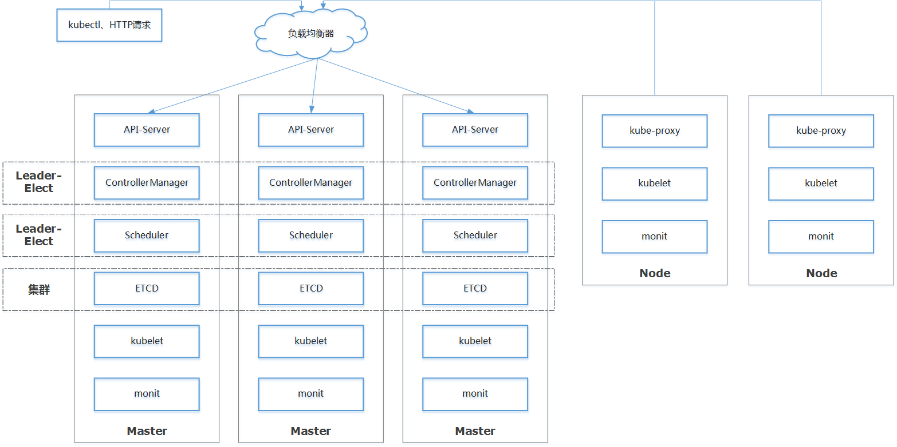
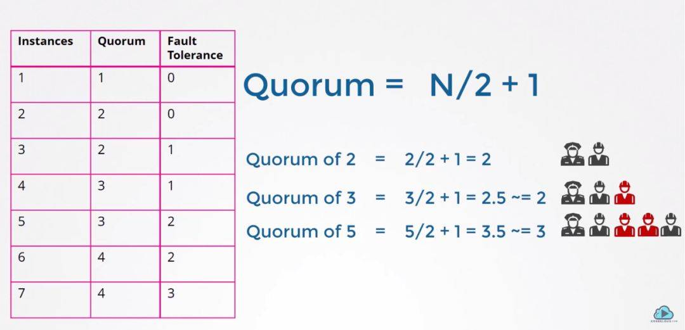
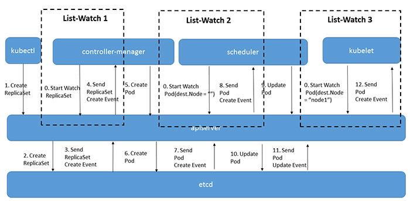
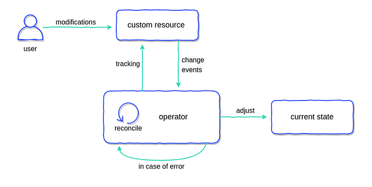

# 整体架构

## 组件

控制面组件：

* kube-apiserver。资源操作入口，对外提供RESTful API供访问。

* etcd。提供高可用的Key-Value持久化存储，为集群元数据。

* kube-scheduler。调度器，负责将pod绑定到node。
* kube-controller-manager。集群状态的维护，包含一系列的控制器（replication controller、endpoint controller等）。
* cloud-controller-manager。负责与具体的云服务提供商对接，适配包括计算资源、负载均衡等云服务。

数据面组件：

* kubelet。容器生命周期管理。
* kube-proxy。服务发现和负载均衡。
* 容器运行时。镜像管理和容器运行，默认为Docker。

## 高可用

高可用要点：

- 多master冗余部署，避免单点失效。
- ETCD：采用Leader-Election机制，当节点失效或网络分区时，过半master节点正常工作可保证选举出新leader。所有节点均可读取，写操作自动转给leader节点。【节点应为奇数】
- Controller-Manager和Scheduler：采用Leader-Election机制，自动选举出leader，由leader实际提供服务；当leader崩溃或网络分区时，自动重新选举leader。【节点应为奇数】
- API-Server负载均衡。API-Server是无状态服务，多个实例通过负载均衡对外提供服务。
- Kubernetes组件容器化部署，并采用多重监控确保组件的可用性。    
- ETCD、API-Server、Controller-Manager、Scheduler、Kube-Proxy均可采用容器化方式部署，以static pod或daemonset方式部署。kubelet负责监控以上组件，一旦组件崩溃，kubelet将自动重启崩溃的组件。    

## 通用模式：Operator模式

### List-Watch

各组件：

* etcd：元数据存储，etcd【有状态】。

* apiserver：与etcd交互，apiserver【无状态】。

* controller-manager、scheduler、kubelet：对特定的Event进行List-Watch，更新系统状态，这些组件是【无状态】。

### CRD+Controller

**自定义资源（CR）**：描述系统预期的状态。

**Controller/Operator**：对CR进行List-Watch，根据CR的定义调整系统当前状态。

Next: [02-测试环境准备](02-测试环境准备.md)

